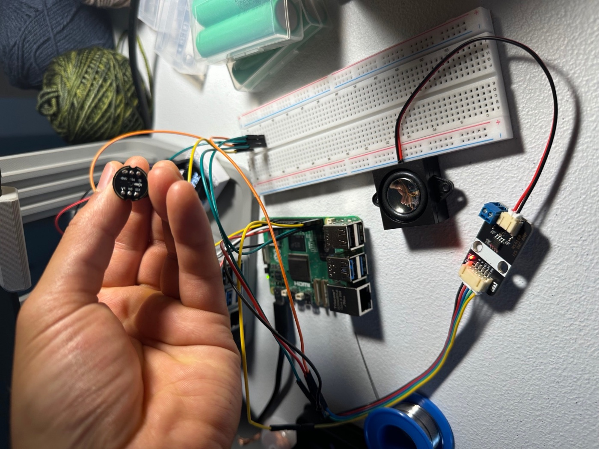

# vayomer

Bare-bones push-to-talk voice assistant running on **petsi** (Raspberry Pi 5).

    INMP441 mic ──I2S──> petsi ──> whisper.cpp ──> Claude Opus 5 ──> piper ──> NS4168 amp ──> speaker

Only the Claude call leaves the machine. STT and TTS are local.

*All of it. The microphone in hand, the Pi behind it, the amplifier board and speaker
on the right. The two clock lines are the ones that fan out to both boards.*

## Use

Two ways in:

| URL | Browser mic works? |
|---|---|
| **<https://petsi.tail835063.ts.net>** (tailnet, real cert) | **yes** |
| <http://petsi.local:8080> (LAN, plain http) | no — not a secure context |

The HTTPS address is `tailscale serve` proxying to port 8080. It is **tailnet-only**,
not public, and Tailscale renews the certificate itself. It survives reboots; to
inspect or remove it: `tailscale serve status` / `tailscale serve --https=443 off`.

Browser *speaker* output works from either address; only microphone capture is gated
on a secure context. Without HTTPS you can also tunnel it, since localhost counts as
secure: `ssh -L 8080:localhost:8080 paul@petsi.local`, then <http://localhost:8080>. Click **Start talking**, speak, click **Stop and send**.
The **Input** and **Output** pickers switch the mic and speaker between petsi's
hardware and whatever device you are viewing on, independently. The bars are the live mic level streamed from petsi over SSE —
the browser never touches your microphone, so no HTTPS is needed.

## Layout

| Path | What |
|---|---|
| `app.py` | FastAPI server: capture, SSE meter, the pipeline |
| `static/index.html` | Single-page UI, canvas level meter |
| `whisper.cpp/` | Built from source; model in `whisper.cpp/models/` |
| `voices/` | Piper ONNX voice |
| `work/` | Scratch wavs, safe to delete |

## Two dials

**Transcription quality vs speed.** `ggml-base.en` runs ~4.3x realtime on this Pi
(2.5s for 11s of audio). For better accuracy, fetch `small.en` and point
`WHISPER_MODEL` at it in `.env` — roughly 3x slower, still usable:

    cd whisper.cpp && sh ./models/download-ggml-model.sh small.en

**Speaker volume** is an ALSA `softvol` stage in `/etc/asound.conf`, currently -20 dB.
It only applies to the `default` device — `aplay -D hw:2,0` bypasses it and plays at
full blast. The NS4168 clips hard above about -15 dB, so higher settings barely change
loudness. Adjust:

    sudo amixer -c 2 set Master -- -14dB && sudo alsactl store

## Gotchas baked in

- The mic sits in the **left** I2S slot; the right slot is silence. Conversion uses
  `pan=mono|c0=c0` rather than `-ac 1`, because averaging L+R would throw away 6 dB.
- Playback deliberately omits `-D` so it goes through `default` and picks up softvol.
- Recording and playback run on the same card — the bus is full duplex, which is also
  why the speaker is audible to the mic. Fine with push-to-talk; it becomes the hard
  problem if this ever goes always-listening.

## Service

    sudo systemctl status vayomer
    journalctl -u vayomer -f
